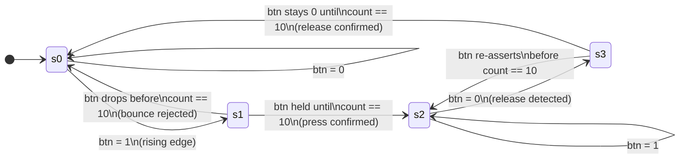
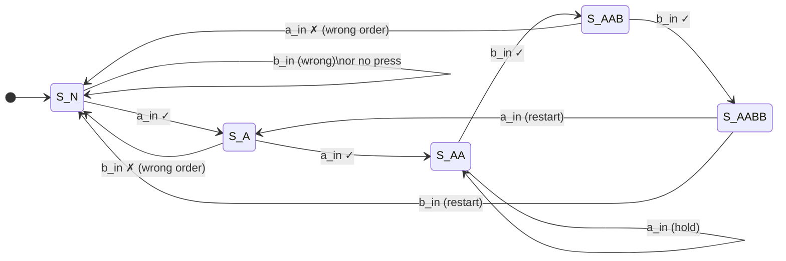

# 4-DIGIT_PASSWORD_LOCK

# 4-Digit Combination Lock — FPGA Implementation

> **Hardware-based sequence-detection lock in Verilog HDL**  
> Designed and verified on the Basys3 (Xilinx Artix-7) FPGA development board at 100 MHz.


---

## Table of Contents

1. [Project Overview](#1-project-overview)
2. [Design Architecture](#2-design-architecture)
3. [Module Descriptions](#3-module-descriptions)
4. [Signal Reference](#4-signal-reference)
5. [LED Output Encoding](#5-led-output-encoding)
6. [FSM State Diagrams](#6-fsm-state-diagrams)
7. [Working of the Design](#7-working-of-the-design)
8. [Supported Operations](#8-supported-operations)
9. [Simulation Results](#9-simulation-results)
10. [Repository Structure](#10-repository-structure)
11. [How to Simulate](#11-how-to-simulate)
12. [Synthesis (Vivado / Basys3)](#12-synthesis-vivado--basys3)
13. [Future Work](#13-future-work)

---

## 1. Project Overview

This project implements a **4-digit combination lock** in synthesizable Verilog HDL, targeting the **Blackboard development board** (Xilinx Zynq XC7Z007S — ARM Cortex-A9 + Artix-7 FPGA) running at a 100 MHz system clock.

The lock accepts a fixed 4-button press sequence — **A, A, B, B** — and unlocks only when the correct sequence is entered and a **lever** (commit) signal is asserted. Any incorrect or incomplete sequence triggers an **alarm**. Progressive LED feedback gives the user real-time visibility of each accepted press.

**Key Design Features:**
- Hardware button debouncing via a 4-state Moore FSM with a 21-bit settling counter
- Rising-edge detection using a 2-FF shift register — one clean pulse per press regardless of hold time
- 5-state Moore FSM for A-A-B-B sequence detection with graceful rejection of all invalid patterns
- Lever-gated commit logic — outcome (unlock/alarm) is only evaluated on lever assertion
- 6-bit LED output with progressive press feedback and sticky `be_asserted` flag
- Fully synthesizable — no inferred latches, no combinational loops, `default_nettype none` throughout

---

## 2. Design Architecture

The design uses a two-module hierarchy: a reusable `debounce` sub-module instantiated twice, and a `lock` top module containing all sequencing and output logic.

```
                   ┌──────────────────────────────────────────────────────┐
                   │                   lock.v  (Top Module)                │
                   │                                                        │
  button_in[1] ───►│  ┌─────────────┐                                      │
  (Button A)       │  │  db_a       │  btn_a_clean                         │
                   │  │  debounce   ├──────────►  ┌──────────────────┐     │
                   │  └─────────────┘             │  Edge Detection  │     │
                   │                              │  (2-FF per btn)  ├──►  │
  button_in[0] ───►│  ┌─────────────┐             │  a_in / b_in     │     │
  (Button B)       │  │  db_b       │  btn_b_clean │                  │     │
                   │  │  debounce   ├──────────►  └────────┬─────────┘     │
                   │  └─────────────┘                      │               │
                   │                              ┌────────▼─────────┐     │
  clk (100 MHz) ──►│                              │  Press Counter   │     │
  rst ────────────►│                              │  (3-bit, resets  ├──►  │──► LED[3:0]
  lever ──────────►│                              │   at count == 4) │     │    (progress)
                   │                              └────────┬─────────┘     │
                   │                                       │               │
                   │                              ┌────────▼─────────┐     │
                   │                              │  Sequence FSM    │     │
                   │                              │  5-state Moore   ├──►  │──► LED[4] (unlock)
                   │                              │  S_N→S_A→S_AA   │     │──► LED[5] (alarm)
                   │                              │  →S_AAB→S_AABB  │     │
                   │                              └──────────────────┘     │
                   └──────────────────────────────────────────────────────┘
```

---

## 3. Module Descriptions

### `debounce.v` — Button Debounce Filter

Instantiated twice inside `lock.v` (`db_a` for Button A, `db_b` for Button B). Each instance implements a **4-state Moore FSM** (s0–s3) with a 21-bit counter that provides a configurable settling window (~20 ms at 100 MHz) to absorb mechanical switch bounce.

**State summary:**

| State | Output (`clean`) | Behaviour |
|---|---|---|
| `s0` (Idle-Low) | `0` | Waiting; transitions to `s1` on rising button edge |
| `s1` (Counting-High) | `0` | Timer runs; if button stays HIGH until `count == 10` → `s2`; if drops early → `s0` |
| `s2` (Stable-High) | `1` | Button confirmed pressed; waits for release → `s3` |
| `s3` (Counting-Low) | `1` | Timer runs on release; if stays LOW until `count == 10` → `s0`; if re-asserts → `s2` |

Any glitch that cannot sustain the button signal for the full counter threshold is absorbed in `s1` without ever asserting `clean = 1`.

---

### `lock.v` — Top Module

The top-level module integrates all lock logic:

- **Two `debounce` instances** — clean the raw `button_in[1:0]` signals
- **2-FF edge detectors** — one per button; produce a single-cycle pulse (`a_in`, `b_in`) per valid press
- **3-bit press counter** — counts total A+B presses; resets at 4, on `rst`, or on `invalid`
- **`be_asserted` flag** — set sticky when `count == 4`; keeps LED[0:3] illuminated after counter resets
- **5-state sequence FSM** — enforces the A-A-B-B pattern; rejects incorrect presses
- **LED driver** — combinational logic mapping FSM state, counter, `be_asserted`, and `lever` to `LED[5:0]`

---

## 4. Signal Reference

### Inputs

| Signal | Width | Description |
|---|---|---|
| `clk` | 1-bit | 100 MHz system clock from Basys3 on-board oscillator |
| `rst` | 1-bit | Active-high asynchronous reset — returns all FSMs and counters to idle instantly |
| `button_in[1]` | 1-bit | Button A — raw, unbounced pushbutton input |
| `button_in[0]` | 1-bit | Button B — raw, unbounced pushbutton input |
| `lever` | 1-bit | Commit signal — when asserted, evaluates the sequence and drives final LED outcome |

### Outputs

| Signal | Width | Description |
|---|---|---|
| `LED[5:0]` | 6-bit | Six on-board LEDs providing real-time press progress, unlock, and alarm feedback |

---

## 5. LED Output Encoding

| Bit | Condition | Meaning |
|---|---|---|
| `LED[0]` | `(count > 0 \|\| be_asserted) && !lever` | Press 1 registered |
| `LED[1]` | `(count > 1 \|\| be_asserted) && !lever` | Press 2 registered |
| `LED[2]` | `(count > 2 \|\| be_asserted) && !lever` | Press 3 registered |
| `LED[3]` | `(count > 3 \|\| be_asserted) && !lever` | Press 4 registered |
| `LED[4]` | `(ct == S_AABB) && lever && !rst` | ✅ **Unlock** — correct sequence committed |
| `LED[5]` | `lever && (ct != S_AABB) && !rst` | 🚨 **Alarm** — wrong or incomplete sequence committed |

> `LED[0:3]` are masked off when `lever = 1`, so only the outcome LED (unlock or alarm) is visible at commit time.

---

## 6. FSM State Diagrams

### Debounce FSM (`debounce.v`)



---

### Sequence FSM (`lock.v`)



| State | Meaning | Encoding |
|---|---|---|
| `S_N` | Idle / no valid progress | 0 |
| `S_A` | First A received | 1 |
| `S_AA` | Second A received | 2 |
| `S_AAB` | First B received | 3 |
| `S_AABB` | Second B received — sequence complete | 4 |

> Any unexpected press at any state resets the FSM to `S_N`. The `default` case also maps to `S_N`.

---

## 7. Working of the Design

### Input Phase — Button Press & Debouncing

1. User presses Button A or B; the raw signal enters the corresponding `debounce` instance
2. The debounce FSM transitions `s0 → s1` and starts the 21-bit counter
3. If the signal remains HIGH for the full settling threshold, `clean = 1` is asserted (`s1 → s2`) — a valid press is confirmed
4. Any glitch that drops before the counter completes causes an immediate return to `s0` — bounce is rejected without propagating to lock logic
5. On release, the FSM mirrors the process in `s3` before returning to `s0`

### Operation Phase — Edge Detection & Sequence Checking

1. `clean` outputs pass through 2-FF shift registers; a single-cycle `a_in` or `b_in` pulse is generated on each rising edge
2. The 3-bit press counter increments on every `a_in` or `b_in`; `LED[0:3]` illuminate progressively
3. The sequence FSM simultaneously evaluates whether the press advances the A-A-B-B pattern:
   - Correct press → advance state
   - Unexpected press → reset to `S_N`
4. When `count == 4`, `be_asserted` is set, keeping `LED[0:3]` lit even if the counter wraps internally

### Output Phase — Lever Evaluation

1. User asserts `lever` after entering the sequence:
   - FSM in `S_AABB` → `LED[4]` lights — **Unlock**
   - FSM not in `S_AABB` → `invalid` asserted, FSM and counter reset, `LED[5]` lights — **Alarm**
2. `LED[0:3]` are masked during lever assertion — only the outcome is shown
3. Asserting `rst` at any point clears all FSMs, counters, and LEDs immediately

---

## 8. Supported Operations

| Operation | Description |
|---|---|
| **Correct Unlock** | Enter A, A, B, B; `LED[0:3]` light progressively; assert lever → `LED[4]` (0x10) |
| **Wrong Sequence Alarm** | Any order other than A-A-B-B + lever → `LED[5]` (0x20); FSM resets |
| **Mid-sequence Reset** | Assert `rst` at any point → all FSMs and counters return to idle; all LEDs off |
| **Bounce Rejection** | Glitch shorter than debounce settling time → absorbed in `s1`/`s3`; not propagated |
| **Invalid Lever Assertion** | Lever asserted before A-A-B-B is complete → `invalid` fires; FSM + counter reset; alarm |
| **`be_asserted` Persistence** | After 4 valid presses, `LED[0:3]` stay lit even after internal counter reset |
| **Simultaneous Press** | Both `a_in` and `b_in` generated on same cycle; FSM processes them independently via edge-detection pipeline |
| **Consecutive Unlock** | After unlock, new presses restart sequence from `S_AABB`; second correct A-A-B-B re-unlocks |

---

## 9. Simulation Results

Simulation was performed using **Xilinx Vivado** and **Questa SIM** with testbench `tb_lock.v`, which applies stimulus to the `lock` top module and monitors `LED[5:0]` across all test scenarios.

### Waveform 1 — System-level Overview (ms scale)

At millisecond scale, the `lever` signal is asserted and de-asserted multiple times across several lock/unlock cycles. `LED[5:0]` transitions between:
- `0x10` → `LED[4]` ON — Unlock (correct sequence)
- `0x20` → `LED[5]` ON — Alarm (wrong sequence)
- `0x00` → All off — Reset state

A `rst` pulse at approximately 12 ms cleanly drives all outputs to `0x00`.

---

### Waveform 2 — Correct Sequence Entry (ns scale)

Zoomed into the 2 µs region, each button press event is visible as a `button_in[1:0]` transition. `LED[5:0]` increments in binary with each registered press:

```
  Press:   1st A    2nd A    1st B    2nd B   lever
  LED:    0x00 → 0x01 → 0x03 → 0x07 → 0x0F → 0x10
```

All four progress LEDs illuminate after the 4th press, and on lever assertion with FSM in `S_AABB`, `LED` transitions to `0x10` — confirmed unlock.

---

### Waveform 3 — Alarm Then Unlock (µs scale)

Captured at the 14 ms region. The lever is asserted mid-sequence (FSM not yet in `S_AABB`), causing `LED` to transition to `0x20` (alarm) and resetting the FSM. A subsequent correct A-A-B-B entry followed by lever assertion then produces `0x10` (unlock), demonstrating clean alarm-then-unlock recovery.

---

### Test Case Summary

| # | Test Case | Expected `LED` | Result |
|---|---|---|---|
| 1 | Correct sequence A-A-B-B + lever | `0x10` | ✅ PASS |
| 2 | Wrong sequence B-A-A-B + lever | `0x20` | ✅ PASS |
| 3 | Partial sequence + lever | `0x20` | ✅ PASS |
| 4 | `rst` mid-sequence | `0x00` | ✅ PASS |
| 5 | Bounce rejection (short glitch) | `0x00` | ✅ PASS |
| 6 | `be_asserted` persistence | `LED[0:3]` hold | ✅ PASS |
| 7 | Lever with no presses | `0x20` | ✅ PASS |
| 8 | Consecutive unlock attempts | `0x10` | ✅ PASS |

---

## 10. Repository Structure

```
4-digit-lock/
├── debounce.v          # 4-state Moore FSM debounce filter
├── lock.v              # Top module — sequence FSM, edge detection, LED driver
└── README.md
```

---

## 11. How to Simulate

### Prerequisites
- **Xilinx Vivado** (2020.x or later) or **Questa SIM** with Verilog-2001 support
- A testbench file `tb_lock.v` instantiating the `lock` top module and driving `clk`, `rst`, `button_in[1:0]`, and `lever`

### Steps (Questa SIM)

```bash
# 1. Compile design and testbench
vlog debounce.v lock.v tb_lock.v

# 2. Launch simulation
vsim work.tb_lock

# 3. Add signals and run
add wave -recursive *
run -all
```

### Steps (Vivado Simulator)

```tcl
# In Vivado Tcl console or simulation settings:

# 1. Add all sources
add_files {debounce.v lock.v}
add_files -fileset sim_1 tb_lock.v
set_property top tb_lock [get_filesets sim_1]

# 2. Launch simulation
launch_simulation

# 3. Run all
run all
```

> **Tip:** The debounce counter threshold is set to `count == 10` in the RTL (abbreviated for simulation speed). For physical FPGA use, increase the threshold to match real switch bounce times (~20 ms at 100 MHz requires `count == 2_000_000`).

---

## 12. Synthesis (Vivado / Blackboard Zynq)

The design is fully synthesizable and targets the **Blackboard development board** (Xilinx Zynq XC7Z007S).

```tcl
# 1. Create project targeting Blackboard Zynq XC7Z007S
create_project lock_proj ./lock_proj -part xc7z007sclg400-1
add_files {debounce.v lock.v}
set_property top lock [current_fileset]

# 2. Run synthesis and implementation
launch_runs synth_1
wait_on_run synth_1
launch_runs impl_1 -to_step write_bitstream
wait_on_run impl_1
```

### XDC Pin Constraints (`lock.xdc`)

```xdc
# 125 MHz system clock — F14
set_property -dict {PACKAGE_PIN F14 IOSTANDARD LVCMOS33} [get_ports {clk}]
create_clock -add -name sys_clk -period 8.00 [get_ports clk]

# Reset (active-high) — K1
set_property -dict {PACKAGE_PIN K1  IOSTANDARD LVCMOS33} [get_ports {rst}]

# Button A — H2
set_property -dict {PACKAGE_PIN H2  IOSTANDARD LVCMOS33} [get_ports {button_in[1]}]

# Button B — J1
set_property -dict {PACKAGE_PIN J1  IOSTANDARD LVCMOS33} [get_ports {button_in[0]}]

# Lever — V2
set_property -dict {PACKAGE_PIN V2  IOSTANDARD LVCMOS33} [get_ports {lever}]

# LEDs LD0–LD5
set_property -dict {PACKAGE_PIN G1  IOSTANDARD LVCMOS33} [get_ports {LED[0]}]
set_property -dict {PACKAGE_PIN G2  IOSTANDARD LVCMOS33} [get_ports {LED[1]}]
set_property -dict {PACKAGE_PIN F1  IOSTANDARD LVCMOS33} [get_ports {LED[2]}]
set_property -dict {PACKAGE_PIN F2  IOSTANDARD LVCMOS33} [get_ports {LED[3]}]
set_property -dict {PACKAGE_PIN E1  IOSTANDARD LVCMOS33} [get_ports {LED[4]}]
set_property -dict {PACKAGE_PIN E2  IOSTANDARD LVCMOS33} [get_ports {LED[5]}]
```

> ⚠️ Before synthesizing for the physical board, update the debounce counter threshold from `10` to approximately `2_000_000` (for ~20 ms settling at 100 MHz) to handle real mechanical switch bounce.

---

## 13. Future Work

| Enhancement | Description |
|---|---|
| **Configurable Sequence Length** | Parameterize the FSM so password length can be changed without manual state re-encoding |
| **User-Programmable Password** | Add a programming mode where the user sets their own A/B sequence at runtime, stored in flip-flop registers or on-chip BRAM |
| **Attempt Limiter with Lockout** | Track consecutive failed attempts and lock the system for a fixed timeout after N failures |
| **7-Segment Display Feedback** | Replace LED progress with a 4-digit 7-segment display showing press count or status ("OPEN", "ERR") |
| **Buzzer / Audio Alarm** | Drive a piezo buzzer output using a simple PWM tone generator on alarm condition |
| **UART Logging** | Transmit FSM transitions and lock events to a host PC terminal for audit and debug purposes |
| **Power Optimization** | Clock-gate the debounce counters when buttons are idle to reduce dynamic power on the FPGA fabric |

---

## Author

**Vedant Vasant Kunjar** — Roll No. 6948  
Target Board: Blackboard (Xilinx Zynq XC7Z007S — ARM Cortex-A9 + Artix-7 FPGA)  
Tools: Vivado (Xilinx/AMD) · Questa SIM (Mentor/Siemens)  
Language: Verilog HDL (IEEE 1364-2001)

---

*For academic and engineering reference use only.*
